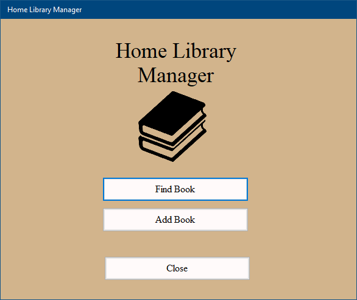
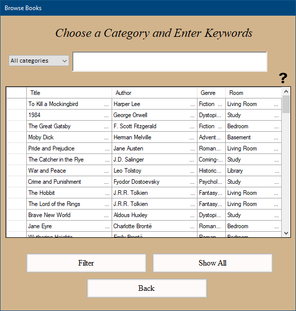
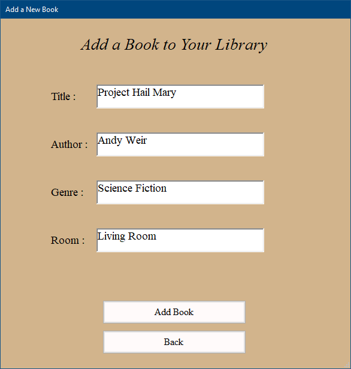

# Home Library Manager

[](https://opensource.org/licenses/MIT)
[](https://dotnet.microsoft.com/download/dotnet-framework)
[](https://github.com/jpaic/home-library-manager)
[](https://docs.microsoft.com/en-us/dotnet/csharp/)

A Windows Forms desktop application for organizing and managing your home book collection. Built with **C#** and **.NET Framework**, backed by a **SQL Server LocalDB** database with **ADO.NET** data access.

---

## Features

| Feature | Description |
|---------|-------------|
| **Full CRUD** | Add, browse, edit, and delete books in your personal library |
| **Smart Search** | Filter your collection by title, author, genre, room, or all fields at once |
| **Data Grid View** | Browse all books in a clean, sortable table layout |
| **Input Validation** | Real-time validation with visual error indicators on all required fields |
| **Context Menu** | Right-click any book to quickly edit or remove it |
| **Room Tracking** | Track which room each book is located in at home |

---

## Screenshots

| Main Menu | Browse Collection | Add / Edit Book |
|:---:|:---:|:---:|
|  |  |  |

---

## Tech Stack

| Layer | Technology |
|-------|-----------|
| **Language** | C# 7.0+ |
| **Framework** | .NET Framework 4.7.1 (Windows Forms) |
| **Database** | Microsoft SQL Server LocalDB (MSSQLLocalDB) |
| **Data Access** | ADO.NET with `System.Data.SqlClient` |
| **IDE** | Visual Studio 2017+ |
| **UI** | Windows Forms Designer |

---

### Security

- **SQL Injection protection** — All queries use parameterized commands (`SqlParameter`)
- **Transaction support** — Multi-step operations roll back on failure via `ExecuteTransaction()`
- **Input validation** — All fields validated before submission using `ErrorProvider`

---

## Getting Started

### Prerequisites

- Windows 7 or later
- [.NET Framework 4.7.1](https://dotnet.microsoft.com/download/dotnet-framework/net471) (included in Windows 10+)
- [SQL Server LocalDB](https://docs.microsoft.com/en-us/sql/database-engine/configure-windows/sql-server-express-localdb) (installs with Visual Studio or SQL Server Express)

### Installation

1. **Download** the latest release from the [Releases page](https://github.com/jpaic/home-library-manager/releases)
2. **Extract** the archive and run `home-library-manager.exe`
3. The application will automatically connect to the LocalDB database

> **Note:** The database file (`Database.mdf`) is included in the repository and located in the project root. Connection string is configured in `App.config`.

### Usage

| Action | How |
|--------|-----|
| **Add a book** | Click *Add Book* on the main menu, fill in the fields, and click *Add Book* |
| **Browse books** | Click *Find Book* to open the full collection |
| **Search** | Type a keyword, select a category (or "All"), and press Enter or click *Filter* |
| **Edit a book** | Right-click a book in the list → *Edit* |
| **Delete a book** | Right-click a book in the list → *Delete* (confirmation required) |

---

## Project Structure

```
home-library-manager/
├── Program.cs                    # Application entry point
├── App.config                    # Database connection string
├── Database.mdf / .ldf           # SQL Server LocalDB files
├── DataAccess/
│   └── DatabaseHelper.cs         # ADO.NET helper (select, insert, update, delete, transaction)
├── Forms/
│   ├── Main_Form.cs              # Main menu (navigation hub)
│   ├── Browse_Form.cs            # Book list, search/filter, right-click edit/delete
│   └── AddBook_Form.cs           # Add and edit book form (dual mode) with validation
└── gfx/
    ├── BookImg.png               # Application book graphic
    └── questionMark.png          # Help icon for context menu hint
```

---

## Building from Source

Open `home-library-manager.sln` in **Visual Studio 2017+** and build the solution (Ctrl+Shift+B). The executable will be placed in `bin/Debug/` or `bin/Release/`.

---

## License

Distributed under the **MIT License**. See [`LICENSE.md`](LICENSE.md) for more information.
